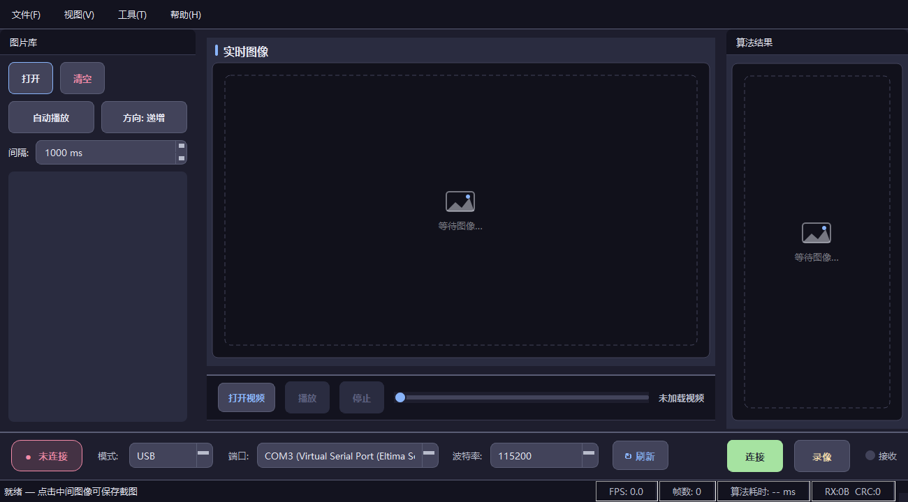
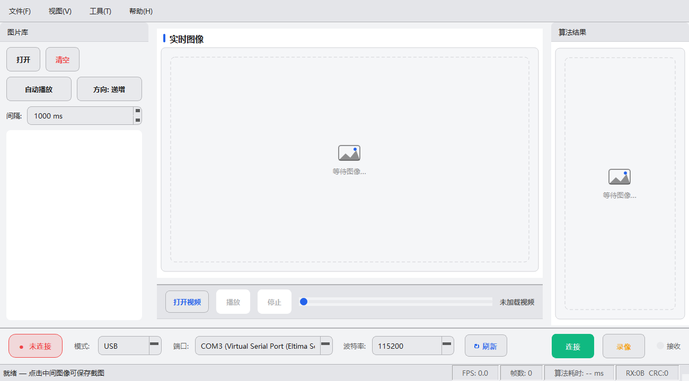

# UpperComputer · 图传上位机

> 面向嵌入式下位机的 **图传 + 遥测 + 调参** 桌面上位机。串口 / WiFi / 蓝牙三通道接收，实时灰度图传、多通道示波、C++ 算法边写边跑。

## 它能做什么

| 功能 | 说明 |
|------|------|
| 📡 三通道通信 | USB 串口 / WiFi（TCP Client·Server·UDP）/ 蓝牙 SPP，一键切换 |
| 🖼️ 实时图传 | 自定义 V2 二进制帧协议还原灰度图像流，点击即存 PNG 截图 |
| 📈 多通道示波 | 遥测波形（int16/int32/float32）、FFT 频谱、数字滤波、悬停读数 |
| 🎛️ 在线调参 | 参数面板二进制下发，下位机 Response 回显，UI 绿/红确认 |
| 🔌 算法插件 | 写 C++ → 一键 `g++` 编译 → 热加载，无需重启程序 |
| 🎬 录像回放 | 自写 MJPEG-AVI 封装与解析，零 ffmpeg 依赖 |
| 🔬 协议分析 | 帧解码器（自定义块协议）+ 逻辑分析仪（UART/I2C/SPI） |
| 🎨 多主题 | 模板生成 6 套皮肤（极简白/经典蓝/浅蓝白/夜樱/夜泊/霜松，深色板基于 Catppuccin·Tokyo Night·Nord），运行时热切换 |
| 🖼️ 自定义壁纸 | 导入自己的图片作背景（png/jpg/webp），可见度可调，二次元氛围拉满 |

## 平台支持

| 平台 | 状态 | 产物目录 |
|------|------|----------|
| Windows 10/11 x64 | ✅ 发布平台 | `bin/` |
| Linux (Arch 验证) | ✅ 开发平台 | `bin_linux/` |

## 快速导航

- **第一次用？** → [快速开始](快速开始.md)
- **自己编译？** → [构建指南](构建指南.md)（Windows / Linux）
- **写下位机固件？** → [通信协议](通信协议.md) · [下位机移植指南](下位机移植指南.md)
- **某个功能怎么用？** → [功能指南](功能指南-图传与截图.md)（图传 / 示波·调参 / 算法插件 / 录像 / 协议分析）
- **遇到问题？** → [故障排查](故障排查.md)

## 界面速览

主界面分四块：顶部工具栏（通信配置 + 指标条）、中央图传视图（原始帧 + 算法结果帧）、底部通信面板（连接状态 + FPS/帧数/RX/CRC 统计）、右侧停靠面板（缩略图画廊、示波器、算法编辑器等）。
